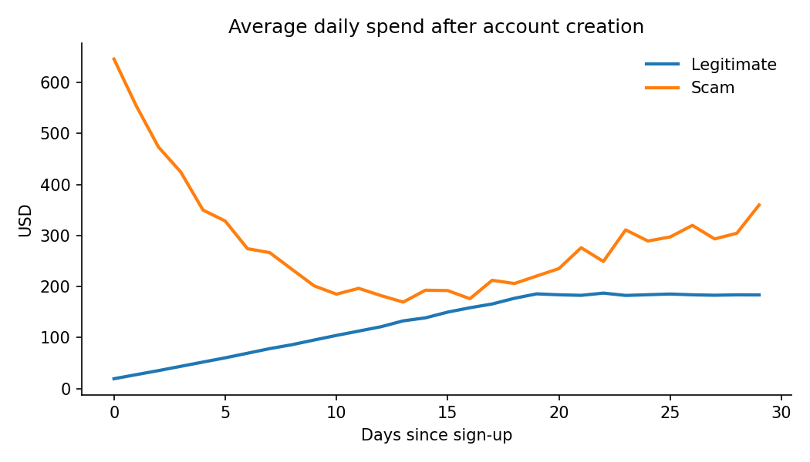
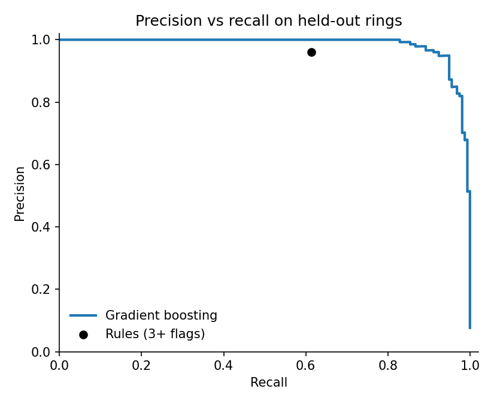

# Scam Advertiser Detection

Finding scam advertisers on an ads platform with SQL, Python and a simple network view, and measuring the cost to legitimate advertisers along the way.

The question I wanted to answer: **how much does a learned model add over a transparent rules baseline, and which kinds of scams does each approach miss?**

> **About the data.** The dataset is simulated (`src/generate_data.py`). It is modelled on abuse patterns that ads platforms describe publicly, and it deliberately includes hard cases on both sides: scam rings that age their domains and ramp up slowly, and legitimate advertisers that look risky (new small businesses, agencies running many accounts on one card). No real people or companies are represented. The pipeline runs unchanged on any data with the same four tables.

## Results

Held-out test set of 2,066 advertisers. Accounts from the same scam ring never appear in both training and test data, so the model is scored on rings it has never seen.

| Approach | Precision | Recall | Legitimate advertisers blocked per 1,000 |
|---|---|---|---|
| Rules baseline (3+ of 5 red flags) | 0.96 | 0.61 | 2.1 |
| Gradient boosting on SQL features | 0.98 | 0.87 | 1.6 |

The model catches about 40% more scam accounts while blocking fewer legitimate advertisers. Precision-recall AUC is 0.985.

**Where each approach succeeds and fails** (share of accounts flagged, by segment):

| Segment | Rules | Model |
|---|---|---|
| Burst scam rings | 95% | 100% |
| Sleeper scam rings (aged domains, slow ramp) | **0%** | 58% |
| Solo scam accounts | 29% | 79% |
| Legitimate: regular | 0.1% | 0% |
| Legitimate: new small business | 1.4% | 0.5% |
| Legitimate: agency-managed accounts | 0% | 1.6% |

What this shows:

1. **Rules catch the obvious rings and nothing else.** Sleeper rings avoid every individual red flag, so a rule set built around new domains and spend bursts never fires on them.
2. **Shared payment instruments are the strongest structural signal**, but they cut both ways. Agencies legitimately run many client accounts on one card and IP block, which is why the model's small false-positive rate concentrates there. In practice those accounts belong in a manual review queue, not an automatic block.
3. **Early spend share is the single most useful feature.** Scam accounts spend most of their budget in the first week before they are caught; legitimate accounts ramp up.



After day 15 the scam line rises again because the burst accounts have stopped spending; the remaining scam spend comes from sleeper accounts that imitate a normal ramp.



## How it works

1. **SQL feature engineering** (`sql/features.sql`): first-week spend share, domain age, landing-page redirects (cloaking), user reports per ad, chargeback rate, and how many accounts share each payment instrument and sign-up IP block.
2. **Rules baseline** (`src/detect.py`): five explainable red flags; an account is blocked at three or more. Easy to defend to an advertiser who appeals.
3. **Network view**: accounts are linked when they share a card or IP block, and each account gets the size of its connected cluster.
4. **Model**: gradient boosting, evaluated with a ring-aware train/test split so scores reflect performance on unseen rings.
5. **Investigation query** (`sql/top_rings.sql`): payment instruments shared by three or more accounts, ranked by user reports and spend, as a starting point for a ring review.

## Run it

```bash
pip install -r requirements.txt
python src/generate_data.py      # writes data/*.csv
python src/detect.py             # prints results, writes figures/ and results.json
```

## Limitations

* Simulated data is cleaner than real abuse data, so absolute scores here are optimistic; the comparison between approaches and the failure modes are the useful part.
* Real systems would add text and image signals from the ads themselves, landing-page crawls, and appeal outcomes as feedback labels.
* User reports can be gamed by competitors, so they should never drive enforcement on their own.

## Author

Mohamed Camara · [LinkedIn](https://www.linkedin.com/in/mo223) · [GitHub](https://github.com/momoc223)
